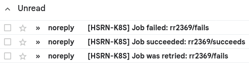

# Kubernetes emailer

This is a simple controller that watches your Jobs and sends an email when they complete or fail. It is meant to offer similar functionality to what typical batch schedulers provide, for example SLURM.



It is available as a Helm Chart which should make it easy to install anywhere:

```console
helm install \
    k8s-emailer \
    oci://ghcr.io/remram44/k8s-emailer/helm-charts/k8s-emailer \
    --version 0.1.3 \
    --namespace kube-system \
    --set emailTag=MY-ORG-CLUSTER \
    --set emailServer.host=smtp.example.org \
    --set emailServer.fromAddress=noreply@k8s.example.org
```

Then users can annotate their jobs to receive emails automatically:

```yaml
apiVersion: batch/v1
kind: Job
metadata:
  labels:
    k8s-emailer.hpc.nyu.edu/mode: "all"
    # "all": email for all status changes (succeeds, fails, restarts)
    # "failure": email on failure (not success)
    # "complete": email or failure or success
  annotations:
    k8s-emailer.hpc.nyu.edu/addresses: "alice@example.org, bob@example.org"
  # ...
spec:
  # ...
```
